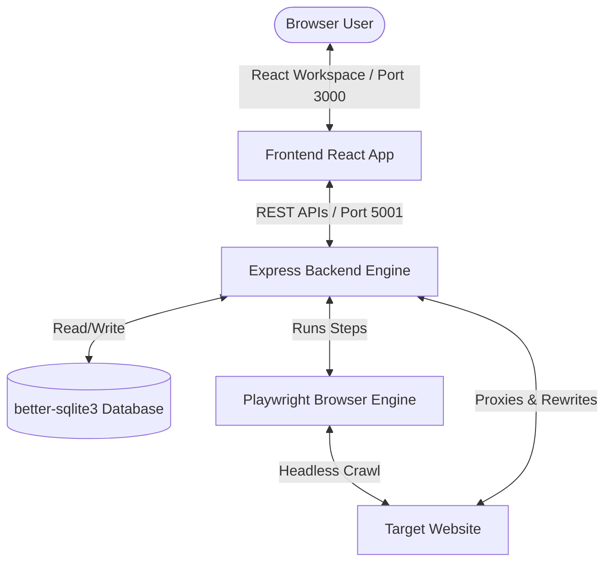

# OmniFetch Architecture

This document describes the design, system flows, and technical implementation details of OmniFetch (WebCapture).

## System Topology

---

## Component Breakdown

### 1. Frontend Workspace (`frontend/`)
- **WebCapturePanel.tsx**: Main orchestration layout container. Holds high-level tabs (Studio, Data Results, Run History) and demo trigger states.
- **BrowserPanel.tsx**: Integrates a sandboxed `<iframe>` acting as the workspace browser. Injects pointer-pick script tags to extract dynamic CSS selectors.
- **RecipeBuilder.tsx**: Form builder interface to edit steps, load recipe presets, trigger runs, and inspect inline execution responses.
- **index.css**: Glassmorphic dark UI framework leveraging a Teal theme HSL colors system.

### 2. Express Backend Server (`backend/`)
- **server.ts**: Setup middleware (CORS, body-parser) and binds routing modules.
- **routes/proxy.ts**: Fetch target URL source, rewrite target domains to route back through our `/api/proxy?url=` endpoint, inject pointer handlers, and output clean HTML.
- **routes/recipes.ts & runs.ts**: Traditional database REST wrappers for SQLite entities.
- **services/db.ts**: Handles database migration schemas (`recipes`, `runs`, and `results` tables) and inserts initial seed recipes.

### 3. Playwright Automation Engine (`automationEngine.ts`)
Executes sequential browser steps in chromium sandbox:
- **navigate**: Opens page context, listens for `domcontentloaded`.
- **click / type**: Interacts with target elements. Uses a heuristic selector normalizer (`sanitizeSelector`) to strip dynamic container IDs (e.g. `tr#49379253`) and nth-child indices to ensure robust execution against dynamic templates.
- **extract**: Runs context script evaluations to aggregate matches for specified CSS paths. Joins parallel column extractions into row-oriented JSON documents for tabular display.
